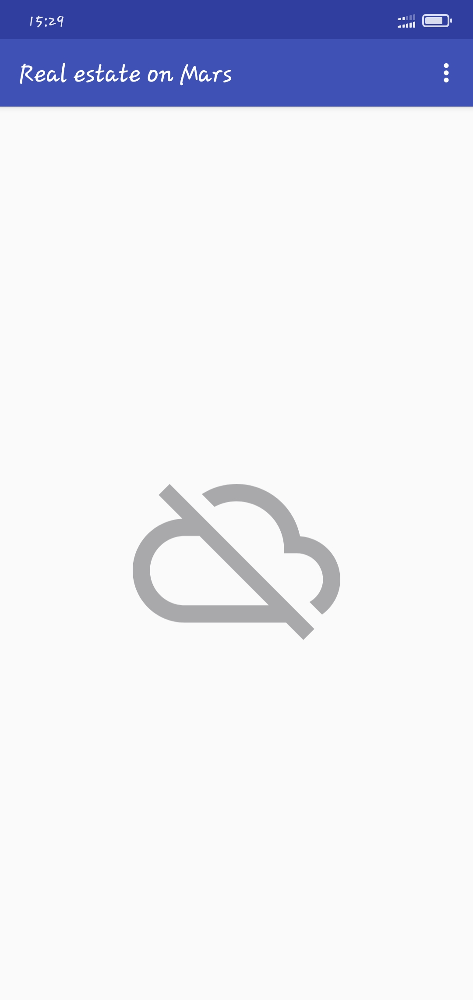
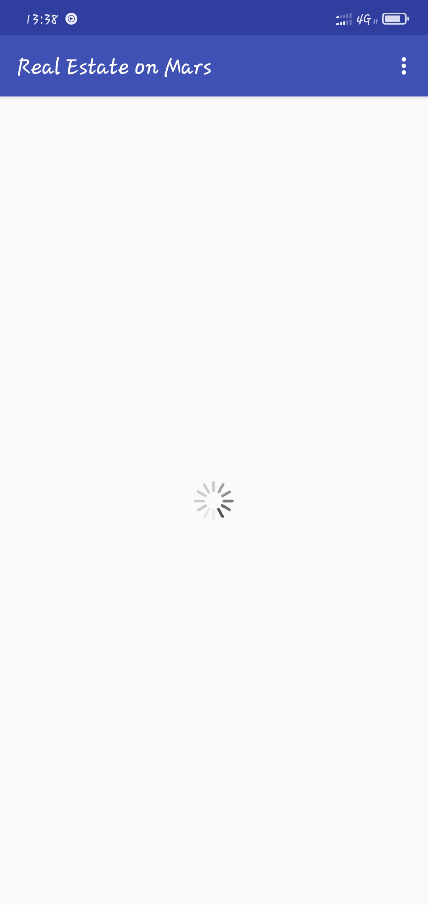
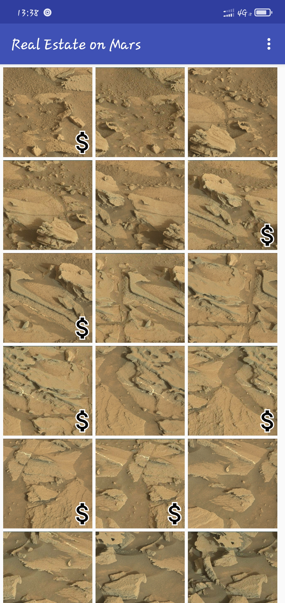
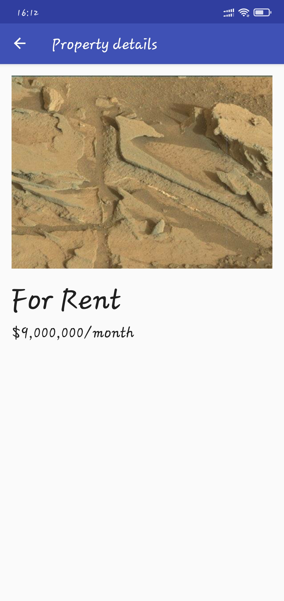
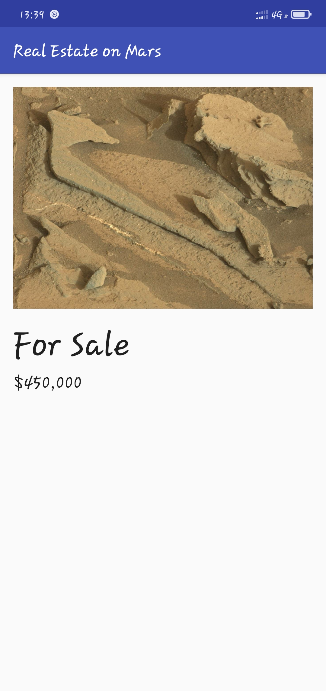

# MarsRealEstate
MarsRealEstate is a demo app that shows available properties for sale and for rent on Mars. The property data is stored on a Web server as a REST web service. This app demonstrated the use of Retrofit to make REST requests to the web service, Moshi to handle the deserialization of the returned JSON to Kotlin data objects, and Glide to load and cache images by URL.

## User Interfaces
    
